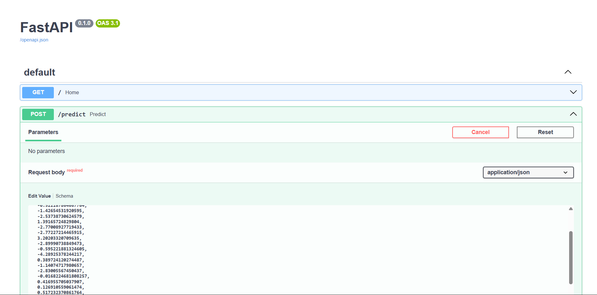
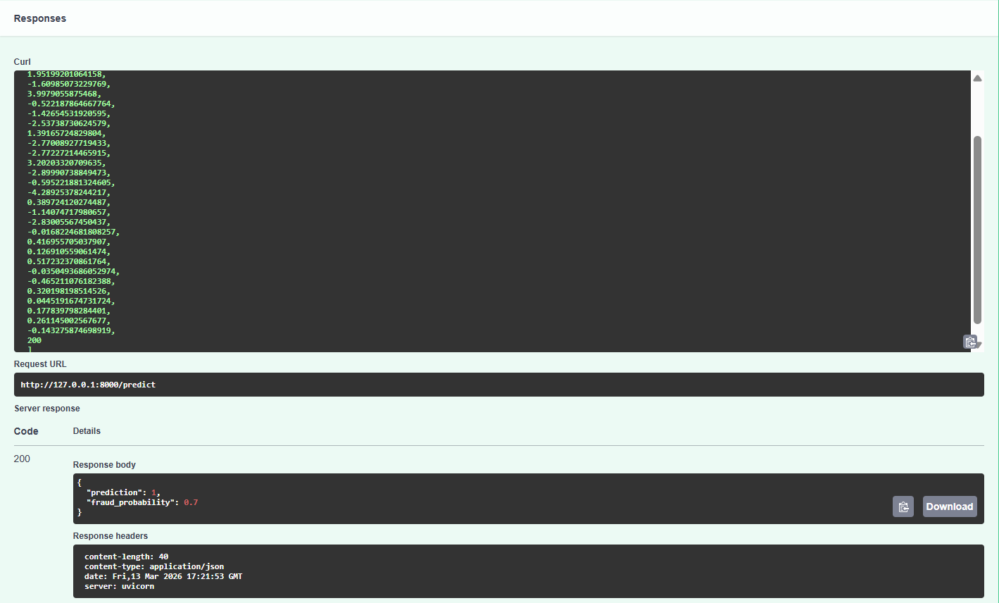

# Credit Card Fraud Detection

An end-to-end machine learning pipeline for detecting fraudulent credit card transactions.
The project trains a Random Forest model on the European credit card dataset and deploys it using **FastAPI** for real-time prediction.

---

## Features

* Exploratory Data Analysis (EDA)
* Handling class imbalance using **SMOTE**
* Random Forest classification model
* Hyperparameter tuning
* Modular ML pipeline
* FastAPI deployment for real-time predictions

---

## Project Structure

```
fraud-detection
│
├── models
│   ├── fraud_model.pkl
│   └── scaler.pkl
│
├── notebooks
│   └── 01_data_exploration.ipynb
│
├── src
│   ├── preprocessing.py
│   ├── train.py
│   ├── predict.py
│   ├── tune_model.py
│   ├── evaluate.py
│   └── api.py
│
├── requirements.txt
└── README.md
```

---

## Installation

Clone the repository

```
git clone https://github.com/omkar42785/fraud-detection.git
cd fraud-detection
```

Install dependencies

```
pip install -r requirements.txt
```

---

## Running the API

Start the FastAPI server:

```
uvicorn src.api:app --reload
```

Open the API documentation:

```
http://127.0.0.1:8000/docs
```

---

## Example API Request

```
POST /predict
```

```
{
 "features": [0.1,-1.2,0.5,-0.3,0.7,0.1,-0.6,0.4,-0.2,0.3,-0.5,0.6,-0.1,0.8,-0.7,0.2,-0.3,0.4,-0.6,0.5,-0.2,0.3,-0.4,0.1,0.2,-0.3,0.4,-0.5,100]
}
```

Example response:

```
{
 "prediction": 0,
 "fraud_probability": 0.02
}
```

---

## Model

Algorithm used:

* Random Forest Classifier

Evaluation metrics:

* ROC-AUC
* Precision
* Recall
* F1 Score

---

## Dataset

European cardholders credit card fraud dataset.

---

## Author

Omkar
## API Documentation



## Prediction Example

